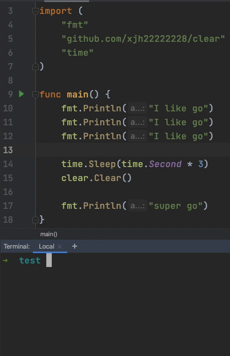

## clear

Clear terminal screen




## Installation
```bash
go get github.com/xjh22222228/clear
```


## Usage
```go
package main

import (
	"fmt"
	"github.com/xjh22222228/clear"
)

func main()  {
	fmt.Println("Please support us")
	clear.Clear()
}
```


## License
[MIT](./LICENSE)
